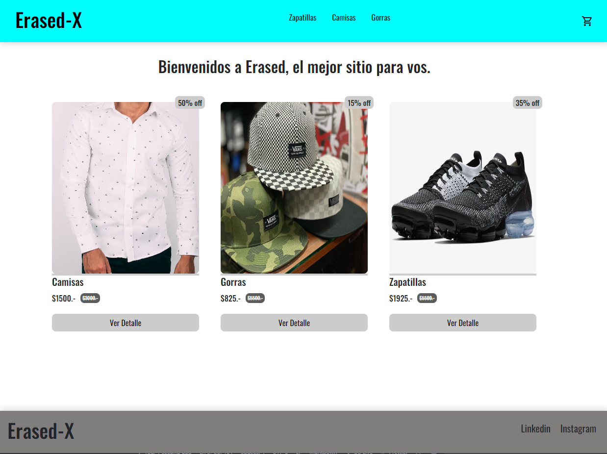

# E-commerce de Ropa Erased-X

Este proyecto es para el curso de React se trata de un e-commerce de ropa, utilizando lo dictado en el.



Link para ver el proyecto deployado
[Erased-x](http://localhost:3000)

## Librerías utilizadas
-   [react-router-dom](https://reactrouter.com/en/main) : Descripción de la librería o rol que cumple en el proyecto
-   Firebase
-   React-spinners
-   React-icons

## Funcionalidades del proyecto

- Se puede agregar articulos a un carrito de compras
- Se puede modificar la cantidad de unidades de cada producto visto
- Se puede navegar al detalle del producto
- Se puede validar el producto comprado mediante un codigo de seguimiento 
 
- Se puede agregar facilmente productos mediante Firebase 

## Pasos para levantar el proyecto en local
```
npm start
```
## 1.Como clonar repositorio

```
git clone https://github.com/diegorome3/proyecto-creact.git
```

## 2.Instalar las dependencias del proyecto

```
npm install
```

## 3.Levantar el proyecto en mi local

```
npm start 
```
